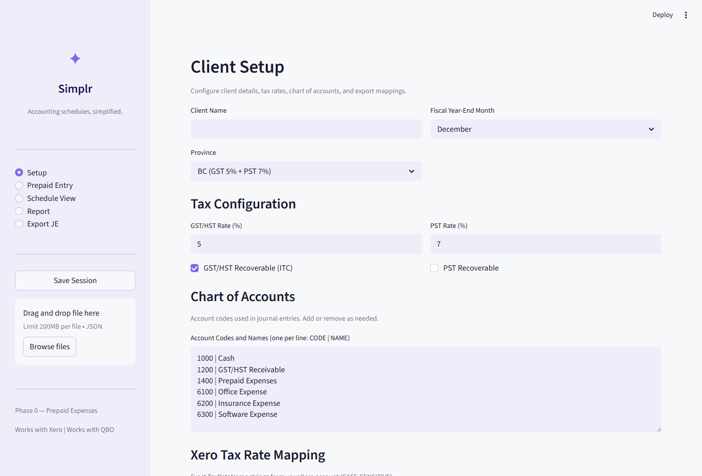
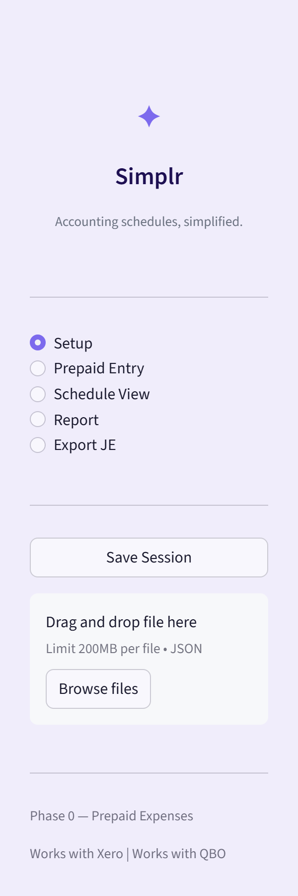
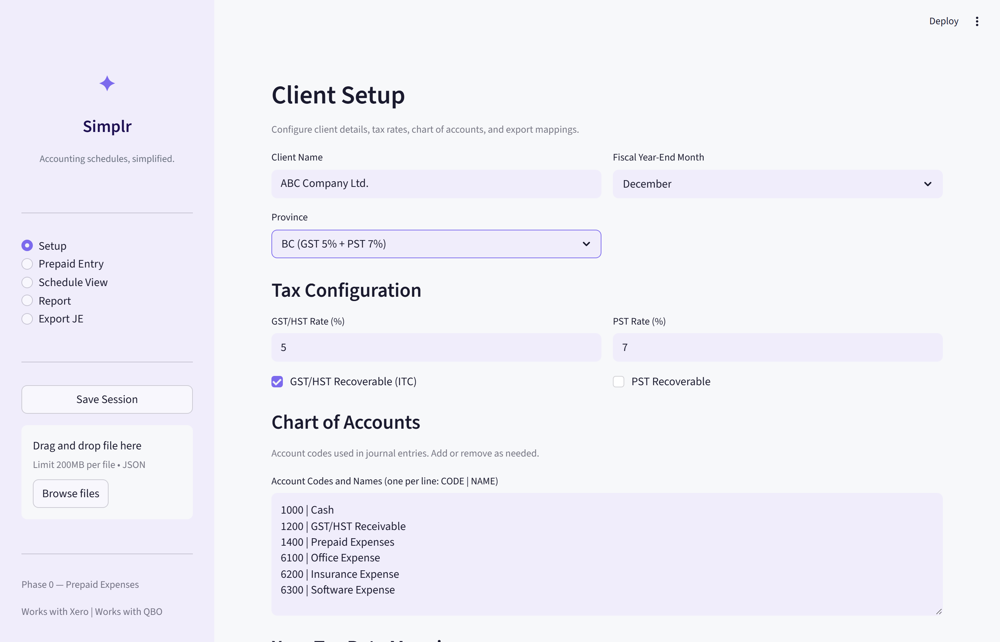
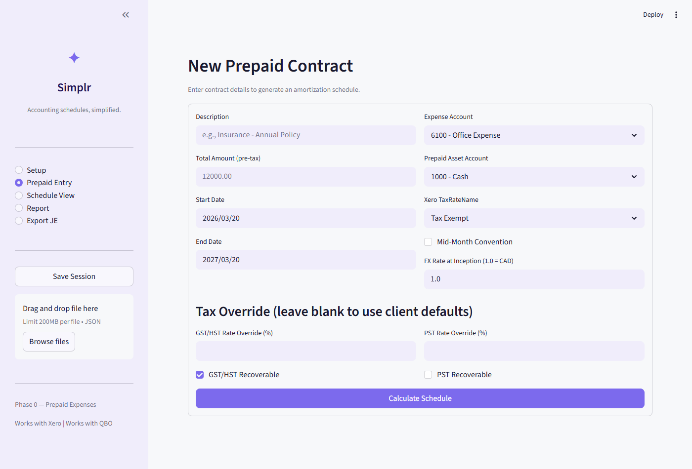
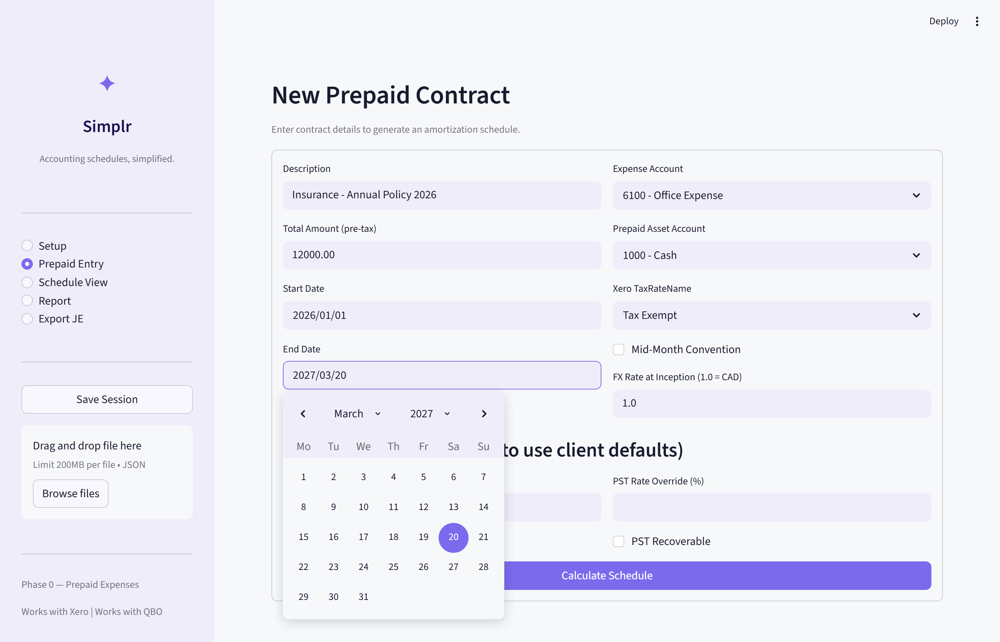
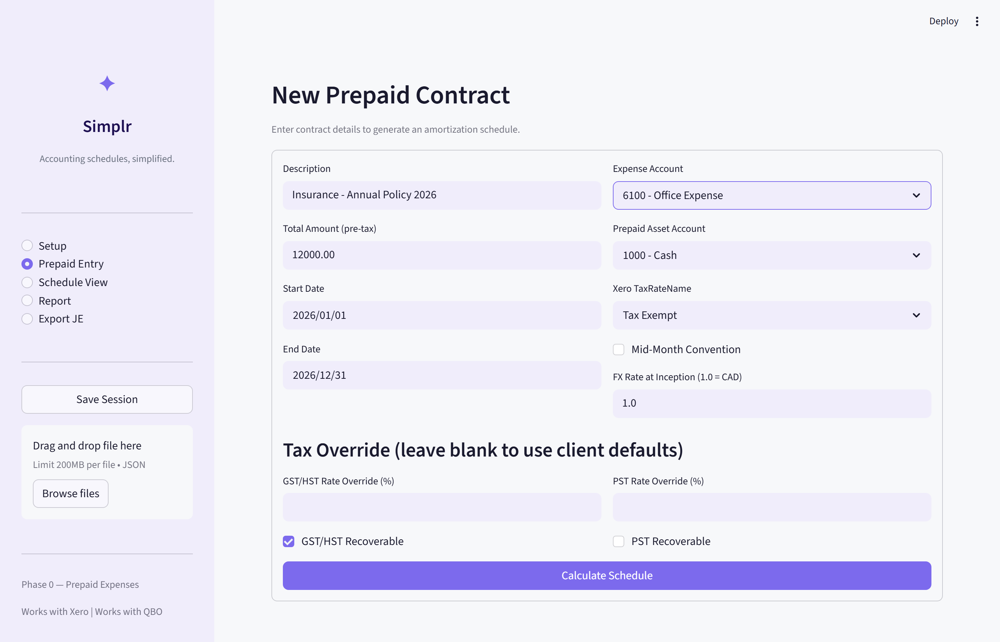
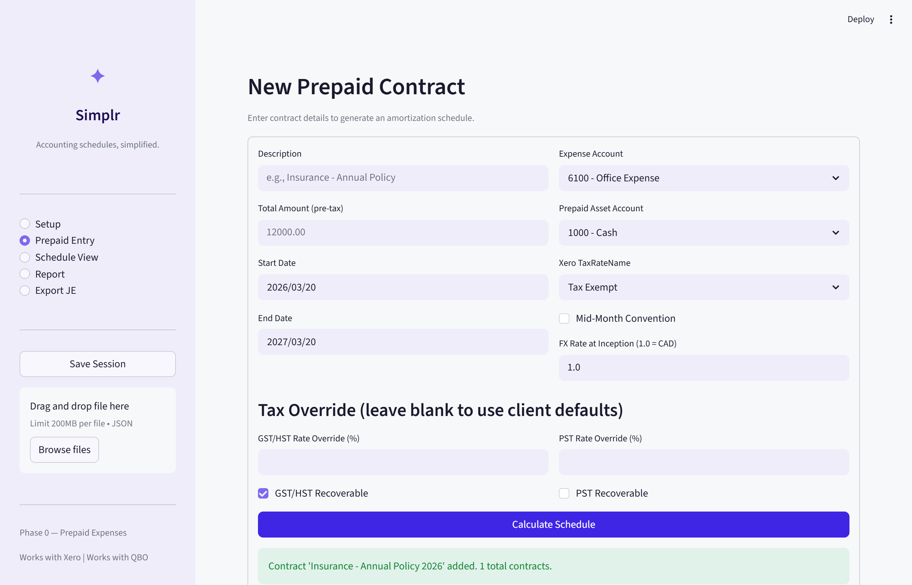
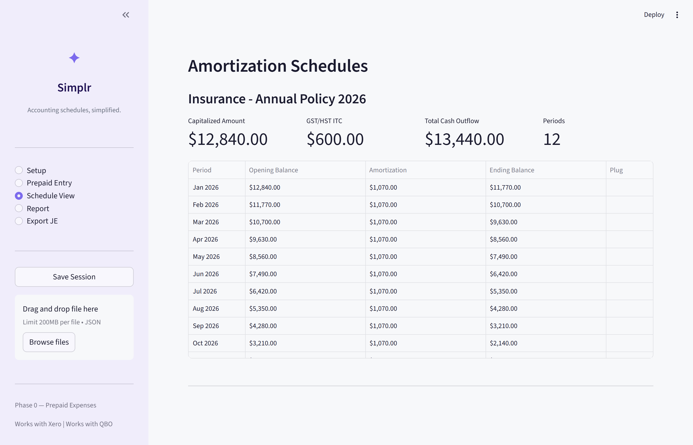
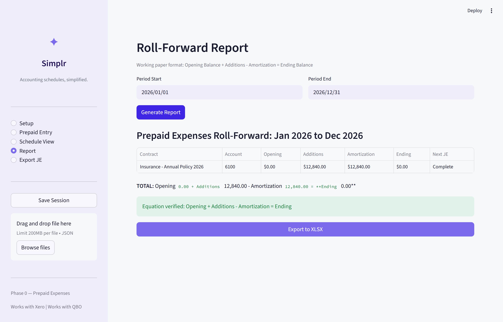
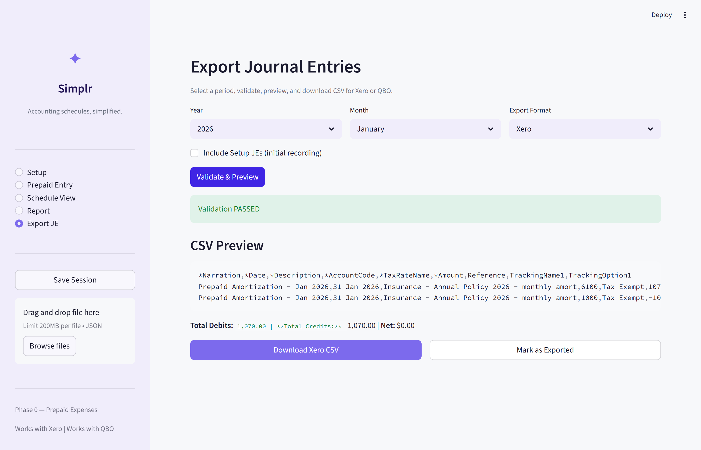

# Simplr — User Manual (Phase 0)

## Prepaid Expenses Module — Step-by-Step Guide

**Version 0.1.0 | March 2026**

---

## Table of Contents

1. [Opening the App](#1-opening-the-app)
2. [Understanding the Navigation](#2-understanding-the-navigation)
3. [Step 1: Client Setup](#3-step-1-client-setup)
4. [Step 2: Creating a Prepaid Contract](#4-step-2-creating-a-prepaid-contract)
5. [Step 3: Viewing the Amortization Schedule](#5-step-3-viewing-the-amortization-schedule)
6. [Step 4: Generating the Roll-Forward Report](#6-step-4-generating-the-roll-forward-report)
7. [Step 5: Exporting Journal Entries (CSV)](#7-step-5-exporting-journal-entries-csv)
8. [Saving and Loading Your Work](#8-saving-and-loading-your-work)
9. [Example: Complete Walkthrough](#9-example-complete-walkthrough)
10. [Troubleshooting & FAQ](#10-troubleshooting--faq)

---

## 1. Opening the App

Open your web browser and go to the Simplr URL provided to you (either the Streamlit Cloud link or `http://localhost:8501` if running locally).

You will see the Simplr app with:
- A **purple sidebar** on the left with the Simplr logo and navigation
- The **main content area** on the right showing the current page



---

## 2. Understanding the Navigation

The sidebar on the left is your main navigation. Click on any page name to switch to it. The currently selected page shows a filled circle next to it.



### Navigation Pages

| Page | What it does |
|------|-------------|
| **Setup** | Configure client info, tax rates, chart of accounts, Xero mappings |
| **Prepaid Entry** | Create new prepaid contracts |
| **Schedule View** | View calculated amortization schedules |
| **Report** | Generate roll-forward working paper reports |
| **Export JE** | Validate and download CSV files for Xero or QBO |

### Save / Load (bottom of sidebar)

- **Save Session** button — downloads a JSON file with all your data
- **Drag and drop / Browse files** area — upload a previously saved JSON file to restore your work


---

## 3. Step 1: Client Setup

> **IMPORTANT:** This is the FIRST thing you must do before anything else. The Setup page configures the client's tax rates, chart of accounts, and Xero/QBO mappings.

Click **"Setup"** in the sidebar to begin.


### 3.1 Client Name and Fiscal Year

| Field | What to enter | Example |
|-------|--------------|---------|
| **Client Name** | The name of the client | `ABC Company Ltd.` |
| **Fiscal Year-End Month** | Month their fiscal year ends | `December` (most common) |
| **Province** | Client's province (auto-fills tax rates) | `BC (GST 5% + PST 7%)` |

**How Province works:** When you select a province, the GST/HST and PST rates below automatically update to that province's rates. For example:
- BC → GST 5% + PST 7%
- Ontario → HST 13% (no separate PST)
- Alberta → GST 5% only (no PST)

### 3.2 Tax Configuration

Scroll down to the Tax Configuration section:



| Field | What it means | Default for BC |
|-------|--------------|----------------|
| **GST/HST Rate (%)** | The GST or HST percentage | `5` |
| **GST/HST Recoverable (ITC)** | Can client claim GST/HST as Input Tax Credit? | ✅ Checked |
| **PST Rate (%)** | The PST percentage | `7` |
| **PST Recoverable** | Is PST recoverable? (almost never in Canada) | ☐ Unchecked |

> **WHY THIS MATTERS:**
> - If GST/HST is **recoverable** (checked) → the GST amount becomes a separate ITC entry, NOT added to the prepaid asset
> - If PST is **not recoverable** (unchecked) → the PST gets **capitalized into the prepaid amount** (added to the asset value)
>
> **Example:** A $12,000 insurance policy in BC:
> - GST 5% recoverable → $600 ITC (separate)
> - PST 7% not recoverable → $840 added to prepaid
> - Capitalized prepaid amount = $12,000 + $840 = **$12,840**
> - Total cash outflow = $12,840 + $600 = **$13,440**

### 3.3 Chart of Accounts

This is where you enter the account codes and names that match your Xero or QBO chart of accounts. Format: One account per line, as `CODE | NAME`


**Default accounts provided:**
```
1000 | Cash
1200 | GST/HST Receivable
1400 | Prepaid Expenses
6100 | Office Expense
6200 | Insurance Expense
6300 | Software Expense
```

**To customize:**
1. Delete any accounts you don't need
2. Add new accounts that match your Xero/QBO setup
3. Make sure the codes and names match **exactly** what's in Xero/QBO

### 3.4 Xero Tax Rate Mapping

> ⛔ **CRITICAL FOR XERO IMPORTS:** The TaxRateName must match **EXACTLY** (case-sensitive!) what appears in your client's Xero account. `"Tax Exempt"` is NOT the same as `"Tax exempt"`. If the case doesn't match, the Xero import will fail silently.


**To find the correct names:**
1. Log into Xero → Settings → General Settings → Tax Rates
2. Copy the exact names (including capitalization)
3. One name per line

**Default values:**
```
Tax Exempt
GST on Expenses
HST ON EXPENSES
```

### 3.5 Tracking Categories (Optional)

If your client uses Tracking Categories in Xero (or Classes in QBO):

| Field | What to enter | Example |
|-------|--------------|---------|
| **Tracking Category Name** | Name of the tracking category | `Department` |
| **Tracking Option** | The specific option/value | `Administration` |

Leave both blank if the client doesn't use tracking categories.

### 3.6 Special Accounts


| Field | What to select | Purpose |
|-------|---------------|---------|
| **Cash / AP Account** | Account for cash payments | Used in Setup JE (initial recording) |
| **GST/HST Receivable Account** | Account for GST/HST ITC | Used when GST/HST is recoverable |

---

## 4. Step 2: Creating a Prepaid Contract

Click **"Prepaid Entry"** in the sidebar. You will see the empty contract entry form:



### 4.1 Fill in the Contract Details

**Left column fields:**

| Field | What to enter | Example |
|-------|--------------|---------|
| **Description** | A clear name for this contract | `Insurance - Annual Policy 2026` |
| **Total Amount (pre-tax)** | Contract amount BEFORE any taxes | `12000.00` |
| **Start Date** | When the prepaid period begins | `2026/01/01` |
| **End Date** | When the prepaid period ends | `2026/12/31` |

**Right column fields:**

| Field | What to select | Example |
|-------|---------------|---------|
| **Expense Account** | Expense account to debit each month | `6200 - Insurance Expense` |
| **Prepaid Asset Account** | Balance sheet account to credit each month | `1400 - Prepaid Expenses` |
| **Xero TaxRateName** | Tax rate name for Xero export | `Tax Exempt` |
| **Mid-Month Convention** | Check if contract starts/ends mid-month | Usually ☐ unchecked |
| **FX Rate at Inception** | Exchange rate (1.0 = CAD) | `1.0` |

Here is an example with the form filled in for the ABC Company insurance policy:



> **MID-MONTH CONVENTION:**
> - **Unchecked (default):** Equal monthly amounts. $12,000 / 12 = $1,000/month
> - **Checked:** First and last months get proportional share based on actual days. Use this when the contract starts/ends mid-month and you need exact allocation.

### 4.2 Tax Override (Optional)

If this specific contract has different tax treatment than the client defaults, you can override here. Leave the override fields blank to use the client default rates from the Setup page.



### 4.3 Calculate and Confirm

Click the purple **"Calculate Schedule"** button at the bottom. If successful, you will see a green confirmation message:



- You can **add multiple contracts** by filling in the form again and clicking Calculate
- To **remove a contract**, click the "Remove" button next to it in the list below the form

---

## 5. Step 3: Viewing the Amortization Schedule

Click **"Schedule View"** in the sidebar.

This page shows the full amortization schedule for each contract, with summary metrics at the top and a detailed month-by-month breakdown.



### 5.1 Summary Metrics

At the top of each contract schedule, you see four key metrics:

| Metric | What it shows | Example Value |
|--------|-------------|---------------|
| **Capitalized Amount** | Amount on the balance sheet (after PST if applicable) | $12,840.00 |
| **GST/HST ITC** | Separate ITC amount (if GST is recoverable) | $600.00 |
| **Total Cash Outflow** | Total paid (capitalized + ITC) | $13,440.00 |
| **Periods** | Number of months in the schedule | 12 |

### 5.2 Amortization Table

The table below the metrics shows the month-by-month amortization breakdown:

| Column | What it shows |
|--------|-------------|
| **Period** | The month (e.g., Jan 2026, Feb 2026, etc.) |
| **Opening Balance** | Balance at start of that month |
| **Amortization** | Amount expensed that month |
| **Ending Balance** | Balance after amortization |
| **Plug** | "Yes" on the last month (absorbs rounding difference) |

> **KEY THINGS TO VERIFY:**
> - First month's Opening Balance = the Capitalized Amount ($12,840.00)
> - Last month's Ending Balance = **$0.00** (always, exactly)
> - Sum of all Amortization amounts = Capitalized Amount (exactly)

---

## 6. Step 4: Generating the Roll-Forward Report

Click **"Report"** in the sidebar. This generates a working paper roll-forward report in the format CPAs expect: Opening Balance + Additions - Amortization = Ending Balance.

### 6.1 Set the Period

| Field | What to enter | Example |
|-------|--------------|---------|
| **Period Start** | First day of the report period | `2026/01/01` |
| **Period End** | Last day of the report period | `2026/12/31` |

### 6.2 Generate the Report

Click the purple **"Generate Report"** button. Here is the result:



### 6.3 Report Columns Explained

| Column | Meaning |
|--------|---------|
| **Contract** | Contract description |
| **Account** | Expense account code |
| **Opening** | Balance at start of period |
| **Additions** | New contracts added during period |
| **Amortization** | Total amortized during period |
| **Ending** | Balance at end of period |
| **Next JE** | Next month's amortization amount (or "Complete") |

The system automatically verifies that **Opening + Additions - Amortization = Ending**. A green checkmark confirms the equation balances.

### 6.4 Export to XLSX

Click the purple **"Export to XLSX"** button to download an Excel file with report metadata, per-contract breakdown, totals row, and professional formatting.

---

## 7. Step 5: Exporting Journal Entries (CSV)

Click **"Export JE"** in the sidebar. This is the final step — generating the CSV file to import into Xero or QBO.

### 7.1 Select Export Parameters


| Field | What to select | Notes |
|-------|---------------|-------|
| **Year** | Year of the journal entries | e.g., 2026 |
| **Month** | Specific month to export | January, February, etc. |
| **Export Format** | Target system | Xero or QBO |
| **Include Setup JEs** | Include initial recording? | Only check for the contract start month |

### 7.2 Validate & Preview

Click the purple **"Validate & Preview"** button. The system checks:
- Are all journal entries balanced (debits = credits)?
- Do all account codes exist in your Chart of Accounts?
- Does the TaxRateName match your configured mappings? (case-sensitive!)
- Is the period open?
- Was this period already exported? (warning if yes)

Here is the result after successful validation:



> **VALIDATION PASSED** = green message. You can download the CSV.
> **VALIDATION FAILED** = red error messages. Fix issues in Setup, then try again.

### 7.3 Understanding the CSV Preview

The CSV content is shown in a preview box. **Review carefully** before downloading.

**For Xero CSV, verify:**
- Date format is `DD MMM YYYY` (e.g., `31 Jan 2026`) — NEVER `MM/DD/YYYY`
- Amounts: positive = debit, negative = credit
- TaxRateName matches exactly what's in your Xero

**For QBO CSV, verify:**
- Date format is `MM/DD/YYYY` (e.g., `01/31/2026`)
- Debit and Credit are in separate columns
- Account names (not codes) match your QBO

### 7.4 Download and Import into Xero

1. Click **"Download Xero CSV"** (or **"Download QBO CSV"**)
2. Click **"Mark as Exported"** to record this period was exported
3. Open Xero → Accounting → Manual Journals → Import
4. Upload the CSV file
5. Xero shows a preview — verify it looks correct
6. Click Import (journals arrive as Draft — review and post)

---

## 8. Saving and Loading Your Work

> ⛔ **IMPORTANT:** Simplr Phase 0 does not have a database. If you close the browser, your data is lost. ALWAYS use Save/Load to preserve your work.


### Saving Your Session

1. Look at the **sidebar** (left side)
2. Click the **"Save Session"** button
3. A JSON file downloads (e.g., `simplr_session_2026-03-20.json`)
4. **Keep this file safe** — it contains all your client config and contracts

### Loading a Previous Session

1. Look at the **sidebar** (left side)
2. In the **"Drag and drop file here"** area:
   - Drag your saved JSON file onto it, **OR**
   - Click **"Browse files"** and select the JSON file
3. The system loads all your data and you can continue where you left off

> **TIP:** Save your session after every significant change. Rename files meaningfully (e.g., `simplr_ABC_Company_March2026.json`) to stay organized.

---

## 9. Example: Complete Walkthrough

This section walks through a real example from start to finish: **ABC Company Ltd. in BC**, with a **$12,000 annual insurance policy**.

### Step 1: Setup

1. Click **"Setup"** in sidebar
2. Enter Client Name: `ABC Company Ltd.`
3. Select Province: `BC (GST 5% + PST 7%)`
4. Fiscal Year-End Month: `December`
5. Tax config auto-fills: GST 5% recoverable, PST 7% non-recoverable
6. Verify Chart of Accounts matches your Xero


### Step 2: Create Contract

1. Click **"Prepaid Entry"** in sidebar
2. Description: `Insurance - Annual Policy 2026`
3. Total Amount: `12000.00`
4. Start Date: `2026/01/01` | End Date: `2026/12/31`
5. Expense Account: `6200 - Insurance Expense`
6. Prepaid Asset Account: `1400 - Prepaid Expenses`
7. Xero TaxRateName: `Tax Exempt`
8. Click **"Calculate Schedule"**


### Step 3: Verify Schedule

Click **"Schedule View"**. You should see:


| Metric | Expected Value | Why |
|--------|---------------|-----|
| Capitalized Amount | **$12,840.00** | $12,000 + 7% PST ($840) |
| GST/HST ITC | **$600.00** | 5% GST on $12,000 |
| Total Cash Outflow | **$13,440.00** | $12,840 + $600 |
| Monthly Amortization | **$1,070.00** | $12,840 / 12 months |
| Periods | **12** | Jan to Dec 2026 |
| Final Ending Balance | **$0.00** | Always zero |

### Step 4: Generate Report

1. Click **"Report"** in sidebar
2. Period Start: `2026/01/01` | Period End: `2026/12/31`
3. Click **"Generate Report"**


### Step 5: Export January to Xero

1. Click **"Export JE"** | Year: 2026 | Month: January | Format: Xero
2. Click **"Validate & Preview"**
3. Review the CSV preview


4. Click **"Download Xero CSV"**
5. Click **"Mark as Exported"**
6. Import into Xero → Accounting → Manual Journals → Import

### Step 6: Export February

1. Change Month to **February**
2. Validate, Preview, Download, Import
3. Repeat for each subsequent month (March, April, etc.)

### Step 7: Save Your Work

Click **"Save Session"** in the sidebar. Keep the file safe.

---

## 10. Troubleshooting & FAQ

### "Validation FAILED — INVALID_TAX_RATE"
The TaxRateName doesn't match what's in Xero. Go to Setup → Xero Tax Rate Mapping and make sure the names are **exactly** the same (case-sensitive). Check your Xero account: Settings → Tax Rates.

### "Validation FAILED — INVALID_ACCOUNT"
An account code in the journal entry doesn't exist in your Chart of Accounts. Go to Setup → Chart of Accounts and add the missing account.

### "No journal entries found for this period"
The selected month doesn't have any entries. Check that:
- You've created a contract in "Prepaid Entry"
- The month you selected falls within the contract's start/end dates

### "This period was previously exported"
This is a **warning**, not an error. It means you already exported this month. If you import again into Xero, you'll create **duplicate** journal entries.

### Data disappeared after refreshing
Simplr Phase 0 stores data in the browser session only. Always use **Save Session** to keep your work. Use **Load Session** (drag JSON file) to restore it.

### How do I add more contracts?
Go to "Prepaid Entry" and fill in the form again. Each "Calculate Schedule" click adds a new contract. All contracts appear together in Schedule View and Reports.

### Can I edit a contract?
In Phase 0, you cannot edit directly. Remove the contract (click "Remove" button) and re-create it with the correct values.

### What is the Plug column?
The last month absorbs any rounding difference (the plug). This ensures the ending balance is always **exactly $0.00**, even when amounts don't divide evenly.

### The amounts don't look right
Check:
1. Did you enter the **pre-tax** amount? (Total Amount should not include taxes)
2. Is the province set correctly? (affects PST capitalization)
3. Is PST set to non-recoverable? BC PST gets added to the prepaid amount

---

*Simplr — Accounting schedules, simplified.*
*Phase 0 — Prepaid Expenses Module — Version 0.1.0*
